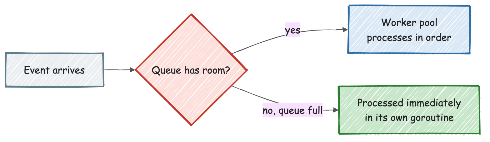
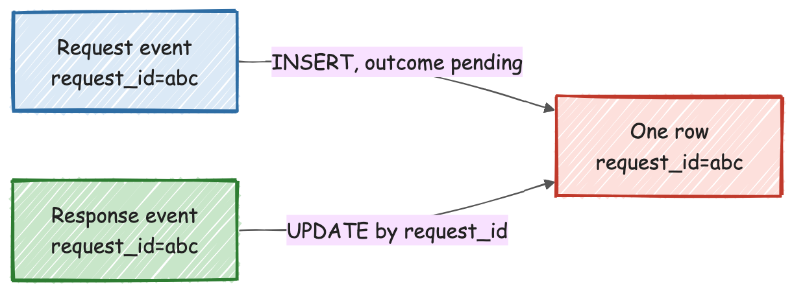

[← Back to index](../index.html)

# Auditing AI API Traffic with Envoy, Lua, and a Go Logging Service

Say you're proxying traffic to a hosted AI coding-completion or chat API, and you need an audit trail — who called what, what did the model actually say, how long did it take — without touching the client or the upstream API itself. This is a pattern for doing exactly that with two small pieces: an [Envoy](https://www.envoyproxy.io/) proxy running a [Lua filter](https://www.envoyproxy.io/docs/envoy/latest/configuration/http/http_filters/lua_filter) to capture traffic at the point it already flows through, and a small Go service that turns those captures into durable, queryable records.

## Envoy as the capture point, not just a reverse proxy

The proxy already sits in the request path, which makes it the cheapest place to add an audit trail — no client change, no upstream change. A Lua filter attached to the HTTP filter chain gets programmatic access to headers, bodies, and the routing decision itself, on both the request and response side of every call.

**Routing by a claim embedded in the caller's own token, not a separate control plane.** Rather than a static one-upstream-per-listener setup, the caller's bearer token carries a claim naming which upstream it's meant to reach. The Lua filter extracts that claim, validates it against an allowlist, and rewrites the request's authority header to the matching upstream — then Envoy's own declarative route table matches on that same claim a second time to pick the actual cluster. That's not redundant by accident: it's two independent checks (one imperative, in Lua; one declarative, in the route config) rather than trusting a single code path to get authorization and routing both right. If the Lua validation logic has a bug, the declarative route match is a second, independently-configured gate the request still has to clear.

**Health checks need their own bypass, twice.** Because the Lua filter runs on every request that reaches it, an unauthenticated health-check ping would otherwise fail the same token validation a real client request goes through. The fix here has two layers: the Lua script checks the path and responds immediately before any auth logic runs, and the declarative route table *also* has a direct-response route for the same paths. Belt and suspenders — a health check should never depend on the same code path that's being asked to validate real traffic.

**One transaction, two log events, correlated later — not held in memory across the two.** A request and its eventual response arrive at genuinely different points in the filter chain, sometimes seconds apart, sometimes never (if the upstream never responds). Rather than trying to hold state in the proxy across that whole span, each side emits its own independent event — a "request" event when the call starts, a "response" event when it completes — tagged with the same request ID, and lets the *storage* layer stitch them together. Trying to correlate them inside the proxy itself would mean carrying state across an unbounded window and cleaning it up on every possible failure path; correlating downstream, by a shared ID, sidesteps that entirely.

**Three numbers instead of one for latency.** The proxy measures wall-clock time from when it first saw the request to when the response headers came back — that's total round-trip time. Separately, the proxy's own instrumentation already knows how long the upstream itself took to respond. Subtracting the second from the first gives a third number: how much time the proxy and its own logging call added on top of the upstream's own latency. Publishing all three, instead of just "the request took N ms," is what lets a slow-request investigation actually point at the right layer instead of guessing.

**The call to the logging service is synchronous, not fire-and-forget — and that's a deliberate trade-off worth naming.** The Lua filter's outbound call to the logging endpoint blocks within the filter chain, with a bounded timeout, rather than firing and forgetting. That buys a real guarantee — the proxy knows at request time whether the log call itself succeeded or failed — at a real cost: the logging endpoint's own latency briefly becomes part of every proxied request's latency. That trade-off only holds up if the logging endpoint is held to a strict, low, and reliable response-time bar — which is exactly what the next piece is designed around.

## The Go service: decoupling capture from durable storage

Because the proxy's call into it is synchronous, this service has one non-negotiable job: answer fast and reliably, no matter what's happening downstream. Everything about its internals follows from that constraint.

**A bounded queue with a worker pool, and an overflow path that never blocks the caller.** Incoming events go into a fixed-size queue; a small pool of workers drains it and does the actual (slower) work — parsing, sanitizing, writing to a file, writing to a database. If the queue is momentarily full, the event isn't dropped and the caller isn't blocked either — it's handed off to its own one-shot goroutine and processed immediately, outside the queue's ordering discipline. The trade-off under sustained overflow is more concurrent goroutines, not lost events and not backpressure on the proxy that's waiting synchronously on this exact call.

**Correlating two async events into one row via upsert, not two rows joined later.** The request event does a straightforward insert — a new row, keyed by request ID, with the eventual outcome fields (status, response body, timings) still empty. The response event, arriving independently and later, does an update against that same row by the shared request ID rather than inserting a second row. The result is one coherent, queryable record per transaction, built from two decoupled writes that never had to coordinate directly with each other — only through the shared key.

**Reconstructing a streaming response into one readable record.** A chat/completion API's response is typically a stream of incremental chunks (a server-sent-events-style stream of small JSON fragments, each carrying a piece of the model's output), which is great for a live client and useless for an audit log — nobody wants to page through hundreds of fragment rows to read what the model actually said. Concatenating those chunks back into the model's full final text at ingestion time is what turns the raw wire format into something a human reviewing the log can actually read.

**Tiered persistence: everything to a file, only the transactions worth keeping into the database.** Every event, successful or not, gets appended to a file log — cheap, complete, good for raw debugging of a specific failure. Only successful (2xx) transactions get the full round-trip persisted into the relational store, which keeps the queryable database focused on the transactions actually worth analyzing instead of accumulating every transient failure as if it were a first-class record. Two storage tiers, two different jobs: one for "what happened, in case I need to dig," one for "what should be easy to query and report on."

**Sanitizing sensitive data at the one chokepoint everything passes through.** Authorization headers get stripped before anything is written to a file or a database — done once, centrally, at the point where every event converges, rather than trusting every upstream producer of a log event to have already scrubbed it. Centralizing a security control at the aggregation point means it can't be silently skipped by a caller that forgot; enforcing it per-producer means it eventually will be.

**Falls back gracefully when the database isn't there.** The service runs in a file-only mode with no configured database at all, and even with a database configured, a failed write is logged and the request still succeeds rather than being treated as fatal. Given that this service's entire reason for existing is to never become the reason a proxied request fails, degrading a storage tier rather than the whole pipeline is the only sensible default.

## Mental model

> The proxy is the only place positioned to see everything without changing anything else, which makes it the right capture point — but a proxy that's slow because its logging call is slow defeats its own purpose. Splitting "capture" (fast, synchronous, minimal) from "durable storage" (queued, tiered, asynchronous where it can be) is what lets each half be simple: the proxy only has to answer "did the log call succeed," and the ingestion service only has to answer "can I absorb this without falling behind," and neither one has to solve the other's problem.
