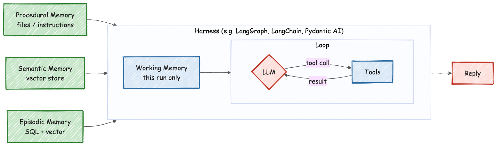
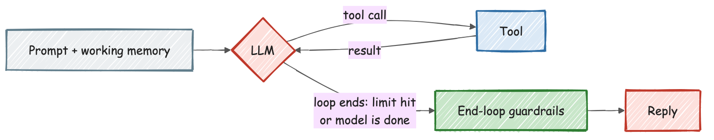
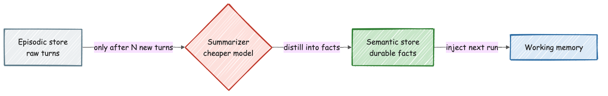

[← Back to index](../index.html)

# Harness Engineering, Loop Engineering, and the Four Kinds of Agent Memory

"Building an AI agent" is really three separate engineering problems wearing one trenchcoat: the **harness** (the framework wrapping the model), the **loop** (what happens during one run), and **memory** (what persists between runs, and in what shape). Conflating them is where most agent architectures get muddy — a slow harness rebuild gets blamed on "the model," a runaway loop gets blamed on "memory," and a missing fact gets blamed on "the prompt" when it was actually a retrieval problem. Pulling the three apart, and then pulling memory apart into its actual sub-types, is what makes the rest of the design tractable.

## Harness engineering: build once, run many times

The harness is the framework code that turns "a model" into "an agent" — it composes the system prompt, wires up tools, attaches middleware, and produces something runnable. The engineering discipline here is mostly about **not redoing this work on every single turn**:

- **Compile once, cache, reuse.** A given configuration (model, prompt, tools, memory, extensions) can be built into a deterministic runnable graph and cached by a hash of its own inputs — any change to the configuration produces a different hash and triggers a fresh build; anything unchanged reuses the cached build instead of reassembling it from scratch on every message.
- **Resilience is the harness's job, not the loop's.** Transient provider failures (rate limits, timeouts, 5xxs) get retried with backoff at the harness level, so the loop itself never has to reason about "did that call fail because the model refused, or because the network blipped." Client errors (4xx — bad request, bad auth) are treated differently and never retried, since retrying a request that's wrong by construction just burns time arriving at the same failure.
- **Hard ceilings live here too.** A cap on total model calls and a separate cap on total tool calls per run are cheap insurance against an agent that gets stuck calling the same tool in a cycle — bugs like this are rare but not rare enough to leave unbounded, and the cost of an accidental infinite loop against a metered model API is not hypothetical.

## Loop engineering: what happens inside one run

The loop is the inner cycle: the model reads the current working memory, optionally calls a tool, reads the result, and either calls another tool or decides it's done. Per the diagram's own label — **everything inside the loop is ephemeral**. Nothing in the loop itself is a durable store; it's scratch space for one turn.

Two engineering concerns live specifically at this layer, not the harness layer:

- **Bounding the loop.** Beyond the harness's hard call-count ceiling, the loop needs its own exit condition — the model deciding it has enough information to answer, or a guardrail step catching something before it reaches the user (a policy check, a format validation, a check that a promised action actually happened).
- **Managing the context budget mid-loop.** A long-running loop with many tool calls accumulates history fast, and a model's context window is finite and non-free. When usage approaches the window, a **cheaper model** (not the primary reasoning model) is a good fit for summarizing/compacting older turns down to a smaller footprint — this is a distinct job from generating the actual response, so paying full price for it doesn't buy anything the cheap model doesn't already do well enough. The compaction trigger should key off the *primary* model's window, not the summarizer's own — the summarizer's job is to protect the primary model's budget, not to have a budget problem of its own.

## The four kinds of memory

This is the part worth being precise about, because "memory" gets used as one word for at least four different engineering problems, each with a different natural technology:

### Working memory — this run's scratch space

What it is: the system prompt, the user's message, recent chat history, and anything retrieved from the other three memory types, all assembled into the one prompt the model actually sees for this turn.

The engineering problem here isn't storage — it's **budget**. There's no database to design; there's a token count to manage, a live view of what's consuming it (system prompt vs. injected memory vs. tool definitions vs. conversation history), and a cost estimate per turn. Treat this as an accounting problem: know what's filling the window before it becomes a "why did this response get cut off" bug report.

### Procedural memory — how to act

What it is: instructions for performing a task well — a skill file, a playbook, a set of conventions — that are the same regardless of which user or which conversation is asking.

The natural technology is **plain files**, loaded directly by reference (or matched by a trigger description), not searched by similarity. This is deliberate: procedural knowledge doesn't need "the 3 most similar instructions" — it needs the *exact* instruction for the task at hand, deterministically, the same way every time. Reaching for a vector store here is a common overcorrection; if the retrieval question is "which one exact document applies," a lookup by name or trigger match is simpler and more reliable than embedding similarity ever needs to be. [Understanding Skills](understanding-skills.html) covers this packaging pattern in more depth.

### Semantic memory — durable facts, and it's actually two different technology choices

What it is: knowledge that should persist across conversations and isn't tied to a specific point in time — a user's stated preferences, an org's stable facts, or a whole external knowledge base.

This one splits into two genuinely different implementations depending on scale, and picking the wrong one for the size of the problem is the most common mistake in this whole memory taxonomy:

- **Small and curated** (a user profile, a handful of standing facts, a short running summary): just store it as **plain text and inject it directly into the prompt**. There's no retrieval problem to solve when the entire memory fits comfortably in a few hundred tokens — adding a vector store here is pure overhead for a problem that doesn't exist yet.
- **Large and heterogeneous** (a real knowledge base — documentation, tickets, wiki pages): this is where a **vector store with hybrid search** (dense similarity plus lexical/keyword matching, fused into one ranked list, optionally reranked) actually earns its cost — see [RAG Retrieval Infrastructure](rag-retrieval-mongodb.html) for the full mechanics of chunking, hybrid search, and reranking that this implies once the corpus is big enough that you can't just inject all of it.

The dividing line isn't "is it a fact" — it's "does finding the relevant piece require search, or can the whole thing just be included." Answer that question before picking a technology, not after.

### Episodic memory — what happened, and when

What it is: the history of past conversations and dated events — not "durable facts distilled from experience" (that's semantic memory) but the raw record of *what actually happened and when*.

The natural technology here is genuinely two mechanisms working together, because episodic recall has two different access patterns that don't share one index well:

- **Recency-ordered retrieval** — "what did we discuss last time," "resume this exact conversation" — served by a plain document or SQL store, indexed by time and by conversation/thread identity. A durable, per-thread state store (the kind used for checkpointing an agent's run so it can resume after an interruption) is exactly this: keyed by thread, timestamped, queried in order.
- **Relevance-ordered retrieval** — "have we ever discussed something like this before, regardless of when" — served by a vector index over past turns, the same similarity-search mechanism semantic memory uses, just pointed at conversation history instead of a knowledge base.

That's the "SQL for recency, vector store for relevance" split — not two competing choices, but two complementary retrieval paths over the same underlying episodic data, because "when did this happen" and "what does this resemble" are different questions with different natural indexes.

## Closing the loop: episodic memory feeds semantic memory

Raw episodic history is not itself durable knowledge — it's a growing pile of turns, most of which are noise relative to what's actually worth remembering long-term. The pattern that turns history into a durable fact base is a periodic **consolidation** step, not something that runs on every single turn:

- **Batch it, don't stream it.** Consolidating after every single turn means re-deriving mostly-unchanged facts over and over, at full cost, for no benefit. Triggering consolidation only after N new turns accumulate is cheaper and produces the same eventual outcome — the loss is a small amount of staleness between consolidation runs, which is almost always an acceptable trade for the cost saved.
- **Use a cheaper model for the distillation itself**, the same reasoning as context-window compaction above: summarizing accumulated history into durable facts is not a task that needs the primary reasoning model's full capability, and running it on a cheaper model keeps a background maintenance job from competing on cost with the actual user-facing work.

## A cheat-sheet

| Need | Memory type | Typical technology |
|---|---|---|
| This turn's scratch space | Working | The prompt/context window itself — manage as a token budget, not a database |
| Task instructions, same for everyone | Procedural | Plain files, loaded by reference or trigger match — no search needed |
| A handful of durable, curated facts | Semantic (small) | Plain text, injected directly into the prompt |
| A real knowledge base to search | Semantic (large) | Vector store + hybrid search (+ optional rerank) |
| Resuming or listing past conversations | Episodic (recency) | Document/SQL store, indexed by thread + timestamp |
| "Have we seen something like this before" | Episodic (relevance) | Vector index over past turns |
| Turning history into durable knowledge | Consolidation | Scheduled batch job, cheaper model, writes into semantic memory |

## Mental model

> A harness is built once and reused; a loop runs once per turn and is thrown away; memory is the only thing actually meant to survive between the two. The single biggest design error in agent memory isn't picking the wrong database — it's treating "memory" as one undifferentiated thing instead of recognizing that *how you need to find something* (by exact reference, by curation, by similarity, by recency) determines the technology, not the other way around.
